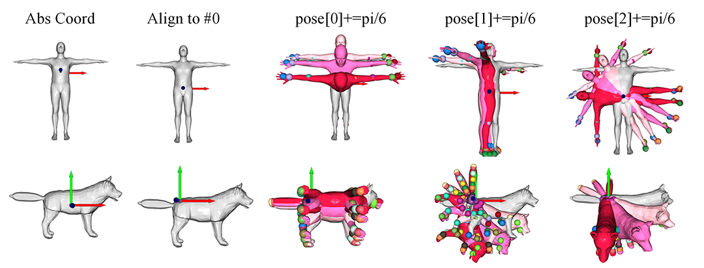

# SMPL and SMAL based on py37

## Overview

Based on the numpy and open3d(0.8.0) in python3.7, we deploy the morphing betas and poses of SMPL and SMAL. This repo can help you learn and debug these two models more efficiently. 

## Teaser
|    Name    | Usage |
| ----------        | --- |
| dB01       |  load rest model from the pkl, and observe the beta para.
| dB02       |  load typical poses from pkl, and observe the pose para.

Here is some screen-shot of the two demo.
- *dB01*: View how the first 3 **beta[:3]** parameters identify the person and animal.
    Notice that when increasing **beta[0]** , the female become taller while the male become shorter.


- *dB02*: View how the first 3 **pose[:3]** parameters(in 1-D scope) influence the model.
    They all control the whole body to rotate w.r.t. **point J[0]**, called " root orientation". 

- *dB02*: For the combined influence of the rest parameters in **pose[3:]** cannot be controlled easily, we directly load the **pose[3:]** from the .pkl and can clearly distinguish different poses as following:


- *dB03*: Add MANO controller to manipulate the hand only.
 Pose control for MANO is a little different from the former two models. 
 For a MANO hand, there are totally 15 joints. 
 According to common sense, the pose should have array_shape in (16*3). 
 In MANO, its first 3 pose_coeff is the same as SMPL; 
 but the last 45 pose parameter controlled in a PCA-like way. 
 There is a **params['hands_components']** with array_shape (45,45) in template .pkl, 
 which contains 45 principle components for last 45 pose parameters. 
 So the post of the last 45 bits can be obtained by multiplying each PC by a scalar weight and summing together. The corresponding scalar weight is called pose_coeff. 
 Finally, **pose_coeff[]** contains the following definition: [:3] for global rotation (pi) + [(3+x):x]for principle components scalar weight(almost 45).
Two hands in different pose:

The pose_coeff[3] effect:

The pose_coeff[4] effect:

The pose_coeff[5] effect:


## File Tree
|    Folder Name    | Usage |
| ----------        | --- |
| com_utils         |  the utilities based on open3d |
| smpl_utils        |  the class definition of SMPL(also for SMAL) |
| template_pkl      | the parameters of rest shapes(diff identity) and typical poses(diff posed) |

## Installation
Environment: python3.7; 
Dependency: numpy, chumpy(only for read old .pkl data format), open3d(Visualization & 3D Operation); 

To create the environment, you can:
```
conda create -n smpl37 python=3.7
pip install -r requirements.txt -i https://pypi.tuna.tsinghua.edu.cn/simple
```
(Nevertheless, chumpy is also needed for some original pikle loading process for **Shape blendshapes** (params['shapedirs'] in the code), but we don't use it when computing. )

