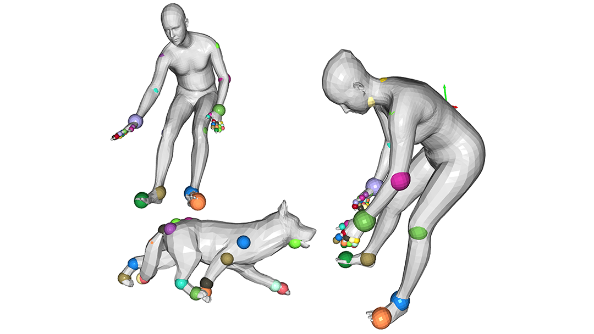
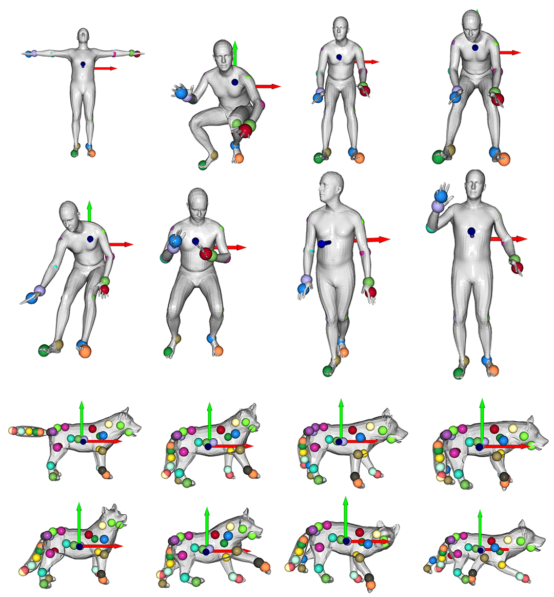
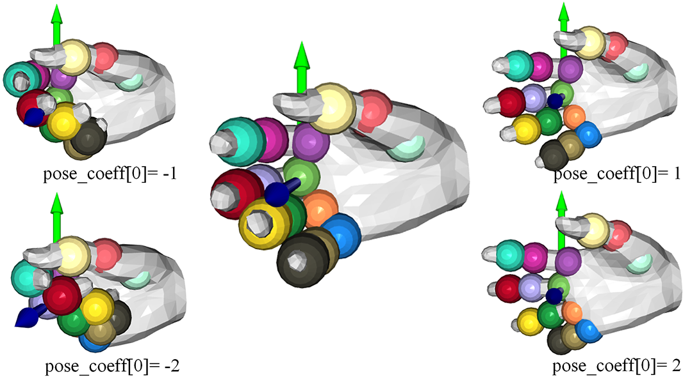

# SMPL, SMAL, MANO based on Numpy (py37)

## Overview


Based on the numpy and open3d(0.8.0) in python3.7, we deploy the morphing betas and poses of 
[SMPL](https://smpl.is.tue.mpg.de/), 
[SMAL](https://ps.is.tuebingen.mpg.de/publications/zuffi-cvpr-2017) 
and [MANO](https://mano.is.tue.mpg.de/). 
This repo can help you learn and debug these models more efficiently. 

## Demo
|    Name    | Usage |
| ----------        | --- |
| dB01       |  load rest model from the .pkl, and observe the beta para.
| dB02       |  load typical poses from .pkl, and observe the pose para.
| dB03       |  update the MANO(pure hand) support.
| dB04       |  update the SMPL with Hand support. 

Here are the illustrations of the 4 demos. demo1 and demo2 are developed for both SMPL and SMAL, 
demo3 is for MANO, and demo4 for SMPLwMANO.

- *Demo1*: dB01_LoadShape.py
    
    View how the first 3 **beta[:3]** parameters identify the person and animal.
    Notice that when increasing **beta[0]** , the female become taller while the male become shorter.


- *Demo2*: dB02_TypicalPose.py

    View how the first 3 **pose[:3]** parameters(in 1-D scope) influence the model.
    They all control the whole body to rotate w.r.t. **point J[0]**, called " root orientation". 

     For the combined influence of the rest parameters in **pose[3:]** cannot be controlled easily, we directly load the **pose[3:]** from the .pkl and can clearly distinguish different poses as following:


- *Demo3*: dB03_Control_pureHand.py

    Add MANO controller to manipulate the hand only.
    Two hands in different pose:
    

    Pose control for MANO is a little different from the former two models. 
    For a MANO hand, there are totally 15 joints. 
    According to common sense, the pose should have array_shape in (16 x 3). 
    In MANO, its first 3 pose_coeff is the same as SMPL; 
    but the last 45 pose parameter controlled in a PCA-like way. 
    There is a **params['hands_components']** with array_shape (45,15 x 3) in template .pkl, 
    which contains 45 principle components(PC) for last 45 pose parameters. 
    So the post of the last 45 bits can be obtained by multiplying each PC by a scalar weight and summing together. The corresponding scalar weight is called pose_coeff. 
    Finally, **pose_coeff[]** contains the following definition: 

    * pose_coeff[:3] for global rotation (pi) ;
    * pose_coeff[(3+x):x]for PC scalar weight(almost 45); 

    The pose_coeff[3] effect:
    
    The pose_coeff[4] effect:
    
    The pose_coeff[5] effect:
    
    Fist 3 beta (shape) effect:
    

- *Demo4*: dB04_Control_SMPL+H.py

    For the MANO use the hand in SMPL(same vertex and faces topology), 
    so these 2 model can be combined to produce richer applications. 
    

    The combined model load the full topology from the weight file from 
    'SMPLH_x.pkl', and load the PC of hand from the MANO pkl. 
    This model use the first 21+1 pose joints in SMPL(**SMPL has 23, del the final two joints of wrist**), 15 joints of left and right hands respectively. 
    
    So its final pose array_shape is (52 x 3). In pose control: 
    - the body part(22 x 3) is set in a SMPL way;
    - the two hand parts(15 x 3) are set in a PC way. 


## File Tree
|    Folder Name    | Usage |
| ----------        | ---   |
| com_utils         |  the utilities based on open3d |
| smpl_utils        |  the class definition of SMPL(also for SMAL) |
| template_pkl      | the parameters of rest shapes(diff identity) and typical poses(diff posed) |

## Installation
Environment: python3.7; 
    
Dependency: 
* numpy; 
* chumpy; (only for read old .pkl data format)
* open3d; (Visualization & 3D Operation); 

To create the environment, you can:
```
conda create -n smpl37 python=3.7
pip install -r requirements.txt -i https://pypi.tuna.tsinghua.edu.cn/simple
```
(Nevertheless, chumpy is also needed for some original pikle loading process for **Shape blendshapes** (params['shapedirs'] in the code), but we don't use it when computing. )

## Acknowledgement
Thanks for the help provided by [Ren](https://github.com/MrPhD) *et al.* in [VCL](https://yangangwang.com/), specifically in model discussing and template providing. 


